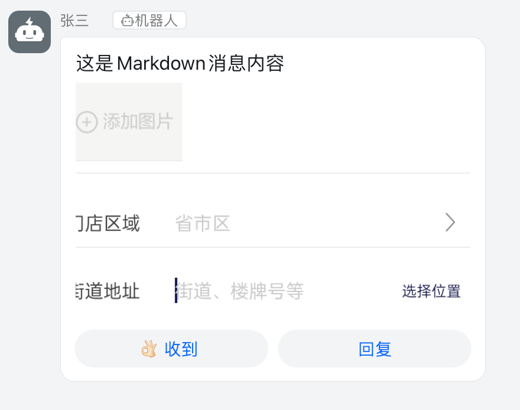

## 消息通知组件

## 功能
* 支持多种通道(钉钉群机器人 飞书群机器人 企业微信群机器人)
* 支持扩展自定义通道

## 环境要求
* php: >= 7.2

## 安装
```bash
composer require wangchengtao/exception-notify
```

## 使用
```php
$channel = new Dingtalk([
    'access_token' => 'xxxxxxxxxxxxx',
    'auth_type' => 'sign', // 安全设置类型: keyword | sign
    'keyword' => '异常', // 当 auth_type 为 keyword 时，必填
    'secret' => 'xxxxxxxxxxxxxxxxxxxx', // 当 auth_type 为 sign 时，必填
    'at' => [], // 当 message 对象未指定@人员时，此为默认值
]);

$client = new Client($channel);

// 文本格式
$text = new DingtalkText();
$text->setTitle('测试');
$text->setContent('异常测试');
$text->setAt([
    '187*****897',
]);

$client->send($text);

// markdown 格式
$markdown = new DingtalkMarkdown();
$markdown->setTitle('Markdown消息标题');
$markdown->setContent("#### 这是Markdown消息内容 \n ");
$markdown->atAll();

$client->send($markdown);
```

## 效果图



## 自定义通道
* 所有自定义通道继承自 `AbstractChannel`
* 所有自定义消息继承自 `AbstractMessage`

```php
use Summer\ExceptionNotify\Channel\AbstractChannel;
use Summer\ExceptionNotify\Message\AbstractMessage;

class CustomChannel extends AbstractChannel
{
    public function handleResponse(ResponseInterface $response): void
    {
        // TODO: Implement getBody() method.
    }
    
    public function send(string $content): ResponseInterface
    {
        // TODO: Implement getBody() method.
    }
}

class CustomMessage extends AbstractMessage
{
    public function getBody() : array
    {
        // TODO: Implement getBody() method.
    }
}

$message = new CustomMessage();
$message->setTitle('自定义标题');
$message->setContent('自定义消息');

$channel = new CustomChannel([
    'access_token' => 'xxxxxxxxxxxxx',
]);

$client = new Client($channel);

$client->send($text);
```